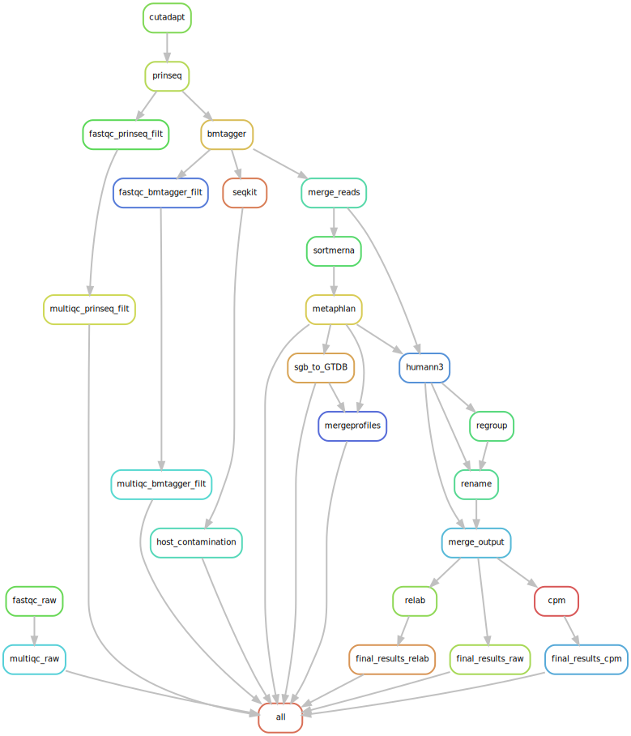

# metatranscriptomics/metagenomics
This pipeline provides a modular workflow for analyzing high-throughput sequencing data, with support for both metatranscriptomics and shotgun metagenomics.

This pipeline is a combination of following existing pipelines with some modifications:

https://github.com/SycuroLab/metqc

https://github.com/SycuroLab/metaphlan4

https://github.com/SycuroLab/metaphlan4_gtdb

https://github.com/SycuroLab/metannotate

 

## **Steps**:

1-<ins> Quality Control </ins>: 
Raw sequencing data undergo quality assessment via FastQC and MultiQC. Cutadapt plays a crucial role in excising adaptor sequences from the raw data and quality is further augmented by Prinseq, which sieves out low-quality reads and sequences of low complexity. 

2-<ins> Host DNA removal </ins>: 
Subsequently, BMTagger is harnessed to remove any host-originating sequences, minimizing potential contamination. 

3-<ins> rRNA Removal </ins>: 
SortMeRNA is employed to filter out any residual rRNA sequences that were not eliminated during experimental procedures, thus refining the metatranscriptomic data to predominantly include non-rRNA transcripts. 
  - Enabled: suited for metatranscriptomics data, where removing rRNA is critical.
  - Disabled: suited for shotgun metagenomics data, where rRNA depletion is not required.

4-<ins> Taxonomy Assignmnet </ins>: 
The ensuing high-quality, rRNA-depleted reads are then channeled through the MetaPhlAn 4 pipeline to determine taxonomic classifications. 

5-<ins> Functional Annotation </ins>: 
Finally, to elucidate the functional attributes of the microbial community, HUMAnN 3 is applied, enabling the quantification of gene family and metabolic pathway abundacies.

 
 

## **Overview**
**Input:**

Raw paired-end fastq files
list_files.txt (a list of input sample names)

 

**output:**
This pipeline consists of four main group of rules shown in utils/rules: **metqc** for quality control and host DNA removal, **sortmerna** for rRNA removal, **metaphlan** for taxonomic assignment, and **metannotate** for functional annotation.

• **metqc** (quality control results)
multiqc/ → MultiQC HTML reports and associated data folders:

multiqc_report_raw.html (raw data QC)

multiqc_report_prinseq_filtered.html (post-PRINSEQ filtering QC)

multiqc_report_bmtagger_filtered.html (post-host-removal QC)

seqkit/ → Seqkit-generated QC summary CSVs:

seq_kit_raw.csv (raw data)

seq_kit_prinseq.csv (post-PRINSEQ)

seq_kit_bmtagger.csv (post-host removal)

qc_seqkit.csv (combined QC summary).

• **sortmerna** (results after rRNA removal)
sortmerna/output/{sample}.fq → Cleaned reads without rRNA reads

• **metaphlan** (taxonomic profiling results)
merged_abundance_table_GTDB.txt → GTDB-based taxonomic profiles (all ranks).

merged_abundance_table_GTDB_species.txt → GTDB profiles at species level.

merged_abundance_table_SGB.txt → SGB-based (species genome bins) profiles.

merged_abundance_table_SGB_species.txt → SGB species-level profiles.

• **metannotate** (functional profiling results)
Contains functional annotation outputs from different normalization methods for gene families

and pathways (using EggNOG, KO, rxn, and UniRef databases):

final_results_raw/ → Raw counts.

final_results_cpm/ → Counts normalized to CPM (counts per million).

final_results_relab/ → Relative abundance values.

Note: Each subfolder includes both stratified (broken down by contributing taxa) and unstratified (overall) tables.

 
 

## **Pipeline summary**

  

Certain rules are executed only when their corresponding parameters are set to True in the configuration file. The SortMeRNA step can be disabled, allowing this pipeline to be used directly for metagenomic shotgun data.

